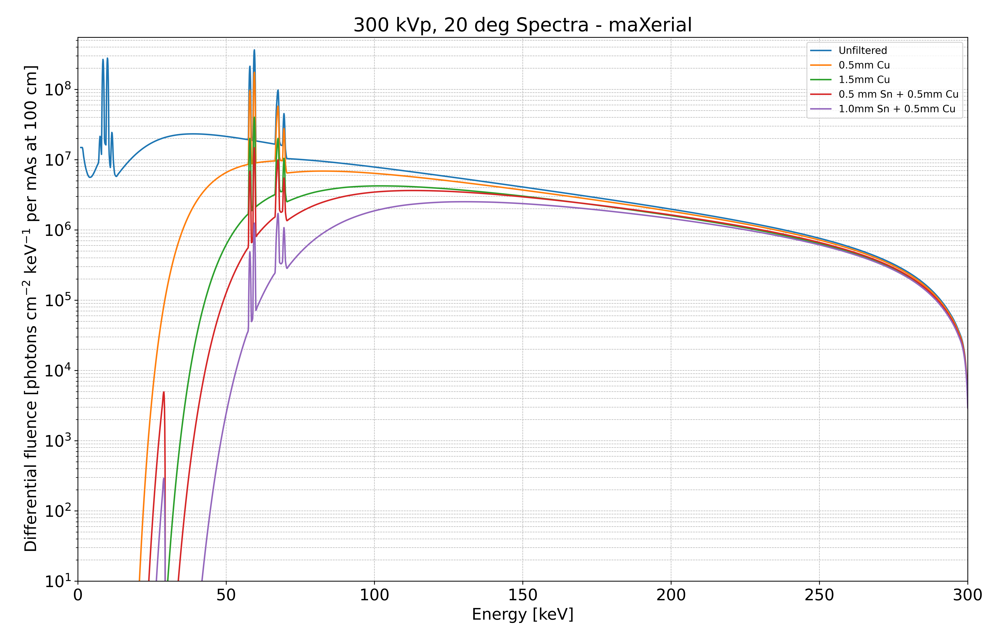
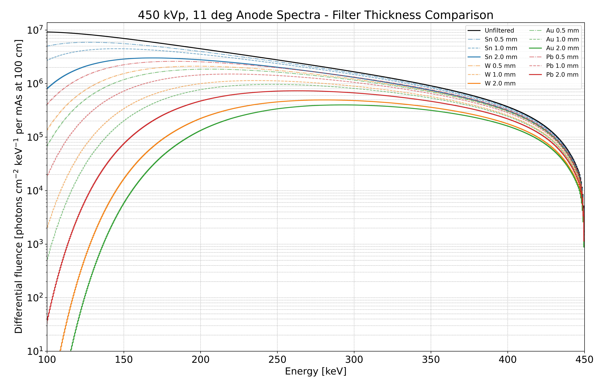

# X-ray Spectrum Simulator Tools

Python scripts for simulating X-ray spectra using [SpekPy](https://bitbucket.org/spekpy/spekpy_release/wiki/Home) focusing on filter effects.


## Scripts Overview

1.  **`tubesim.py`**: Simulates spectra with **stacked filters** defined in `simulation_config.json`.
2.  **`tubesim_filter_comparison.py`**: Compares **fixed filter thicknesses** (0.5, 1.0, 2.0 mm) for Sn, W, Au, Pb for high X-ray emission energies (> 300 keV). Parameters are set directly in the script. 

## Key Features

* Simulates X-ray spectra for a W anode (SpekPy default).
* Configurable simulation parameters (kVp, anode angle).
* Supports sequential application of multiple filters (filter stacking) via `tubesim.py` + JSON.
* Compares pre-defined fixed thicknesses of common materials via `tubesim_filter_comparison.py`.
* Saves simulated spectra to a `./simulations/` subfolder.

## Installation (Conda Recommended)

1.  **Prerequisite:** Install [Miniconda](https://docs.conda.io/en/latest/miniconda.html) or [Anaconda](https://www.anaconda.com/products/distribution).
2.  **Clone Repository:**
    ```bash
    git clone xray-tube-sim
    cd xray-tube-sim
    ```
3.  **Create & Activate Conda Environment:** Create the environment from the provided file and activate it.
    ```bash
    conda env create -f environment.yml
    conda activate spekpy
    ```

## Configuration & Usage

### 1. Stacked Filter Simulation (`tubesim.py`)

* **Configuration:** Modify the `simulation_config.json` file:
    * `simulation_parameters`: Set `kvp`, `anode_angle`, `min_energy_kev`, `max_energy_kev`, `output_basename`.
    * `filter_combinations`: Define each spectrum curve via `label` (for legend) and `filters` (a list of `["Material", thickness_mm]` pairs applied sequentially). An empty `filters` list simulates the unfiltered spectrum.
    ```json
    // Example structure within simulation_config.json
    {
      "simulation_parameters": {
        "kvp": 300.0,
        "anode_angle": 12.0,
        // ... other params
        "output_basename": "maXerial-300kV"
      },
      "filter_combinations": [
        { 
          "label": "Unfiltered", 
          "filters": [] 
        },
        { 
          "label": "1mm Sn + 0.5mm Cu", 
          "filters": [
            ["Sn", 1.0], 
            ["Cu", 0.5]
          ] 
        }
        // ... more combinations
      ]
    }
    ```
* **Run:**
    ```bash
    python tubesim.py
    ```

### 2. Fixed Thickness Comparison (`tubesim_filter_comparison.py`)

* **Configuration:** Modify the constants directly within the `tubesim_filter_comparison.py` script file:
    * `KVP_SET`, `ANODE_ANGLE`: Tube parameters. Max kVp = 500 (limitation by SpekPy)
    * `MIN_K_PLOT`, `MAX_K_PLOT`: Plotting energy range.
    * `FILTERS_AND_THICKNESSES`: Dictionary defining materials and the list of fixed thicknesses (`[0.5, 1.0, 2.0]`) to compare.
    * `HIGHLIGHT_THICKNESS`: Which thickness (usually `2.0`) gets the solid/opaque line style.
    * `MATERIAL_COLORS`, `FIGURE_SIZE`, etc.: Plot styling options.
* **Run:**
    ```bash
    python tubesim_filter_comparison.py
    ```

## Output

Both scripts save their output plots (PNG and PDF) to the `simulations/` subfolder within the repository directory. Filenames include the output basename (for `tubesim.py`) or a standard prefix (for `tubesim_filter_comparison.py`), along with the kVp and energy range.

### Output Plots


**`tubesim.py`**


**Figure 1** &ndash; Simulation of different X-ray emission spectra at 300 kEV using common filter combinations. 

<br/>

**`tubesim_filter_comparison.py`**


**Figure 2** &ndash; Simulations of different filter materials and thickenesses for high energy X-ray tubes (here: 450 kV) for the energy range from 100 keV to 450 keV.

<br/>

## Dependencies

Required Python packages are listed in `environment.yml` (for Conda) and `requirements.txt` (for pip/reference). Key dependencies include:

* `spekpy >= 0.1.5`
* `numpy`
* `scipy` (for `tubesim.py`)
* `matplotlib`

## License

(c) maXerial AG, 2025. All rights reserved.
